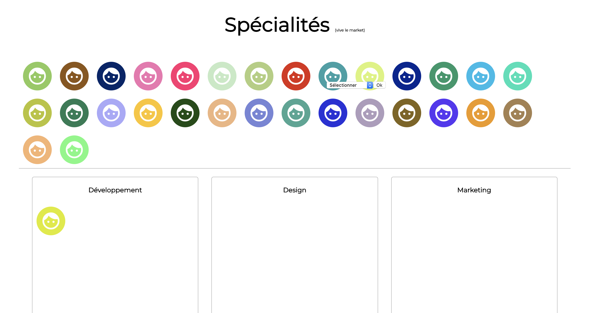

# Choose your spe

This was a little school (EEMI in Paris) exercice to learn and practice JavaScript. 

## Langages used 

* HTML5 / CSS3
* JavaScript

## Exercise Instructions

* The objective is to develop a page to associate people with a school specialty (design, web development, marketing).
* A right-click on each faces brings up a drop-down list that allow you so select a specialty, with a validation button (form + submit)
* When the validation button is clicked, the face moves to the selected specialty
* The 30 faces will be dynamically created in Javascript. The back ground color of each people will be randomly determined in JavaScript

## Screenshot

## Author & date

Made by myself en May 2020

